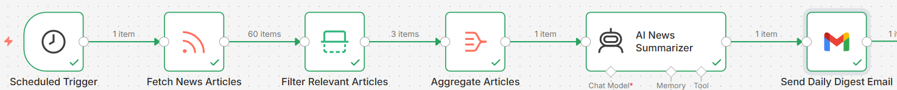
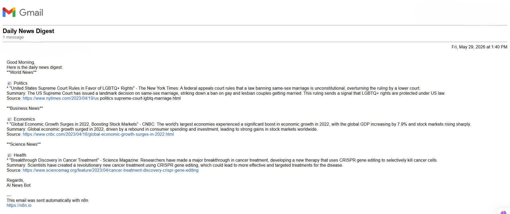
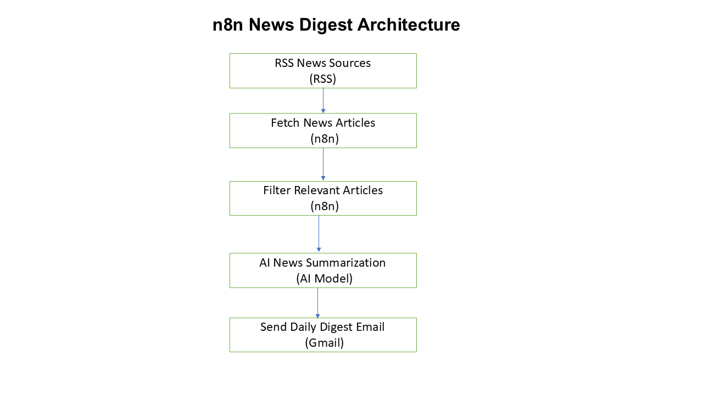

# 📰 AI-Powered News Digest Automation using n8n

## Project Overview

This project is an AI-powered news digest automation workflow built using **n8n**.

The workflow automatically collects news articles from RSS feeds, filters the most relevant content, generates concise summaries using a locally hosted Large Language Model (LLM), and delivers a formatted news digest via email.

The project demonstrates workflow automation, AI-powered text summarization, RSS feed processing, scheduled execution, and automated email delivery through an end-to-end automation pipeline.

This repository is intended for portfolio and project showcase purposes and highlights practical applications of AI and workflow automation.

---

## Workflow Design

The following workflow shows the end-to-end automation pipeline built in n8n.



---

## Sample Output

Below is an example of the AI-generated news digest delivered through email.



---

## System Architecture

The architecture below illustrates the overall flow of data through the system.



---

## Features

- Automated news collection from RSS feeds
- Filtering of relevant news articles
- AI-powered news summarization
- Automated email delivery
- Scheduled execution using triggers
- End-to-end workflow automation
- Minimal manual intervention

---

## Tech Stack

- n8n
- RSS Feeds
- Local LLM
- Gmail
- Scheduler / Trigger Node

---

## Project Architecture

```text
RSS News Sources
        ↓
Fetch News Articles
        ↓
Filter Relevant Articles
        ↓
AI News Summarization
        ↓
Send Daily Digest Email
```

---

## Key Challenges Solved

- Extracting and processing news from RSS feeds
- Filtering relevant articles automatically
- Generating concise AI summaries
- Formatting content for email delivery
- Automating the complete workflow using scheduled execution
- Building a reliable end-to-end automation pipeline

---

## Learning Outcomes

Through this project, I learned:

- Workflow automation using n8n
- RSS feed integration and processing
- AI-powered text summarization
- Email automation
- Designing scalable automation workflows
- Building end-to-end AI solutions

---

## Repository Structure

```text
n8n-ai-news-digest
│
├── README.md
└── screenshots
    ├── workflow.png
    ├── output.png
    └── architecture.png
```

---

## Security Note

This repository is intended for portfolio and project showcase purposes only.

The workflow export, credentials, API keys, tokens, prompts, and configuration details have been intentionally excluded from this repository.

---

## Future Enhancements

- Personalized news categories
- Multi-language news digest generation
- Telegram and WhatsApp delivery
- News sentiment analysis
- Topic-based categorization
- Interactive dashboard for news consumption

---

## Author

### NEHA YADAV

Aspiring Data Scientist | AI & Machine Learning Enthusiast

GitHub: https://github.com/neha2610yadav

---

⭐ If you found this project interesting, feel free to explore the repository.
